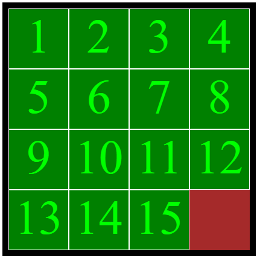

# Slide Puzzle
## Description
Using plain/vanilla JavaScript and 1 animation library (TweenMax), create a slide puzzle of 15 pieces, initially display them in order, but allowing the user to click/slide the square pieces.  The piece will move accordingly (or stay still depending if it can't move).  

See sample gameplay (bonuses included): http://youtu.be/K64lV-ehDgM?hd=1  

## Instructions
Download the attached assignment3.zip html/css/js template (if you don't use this template or if you use another animation library other than the one given, then you'll be awarded a mark of 0)
If the user clicks a square, that square will move only if there exists a blank space immediately above it, to the left of it, to the right of it, or below it.  Otherwise it stays still.

### BONUS +1
 if you can figure out how to make more than 1 square move if applicable

### BONUS +1 
If the user finally sequences the puzzle in order, then alert a message, "Winner!"

### BONUS +1 
Initially display a randomized, shuffled board. Hint: Do not simply put random squares on each spot -- that won't work as it might be impossible to sequence it back in order.
RUBRIC: 

## CRITERIA	
 1. Create puzzlePieces data structure (ex: an array) that contains multiple objects where each object represents a puzzle piece.  For example, each object could be:

{ name: ".box1", x: 0, y: 0 }

It's up to you how you want to structure it.  For example will you use a 4x4 2-dimensional array of objects?  Or a single array of objects?  (There are tradeoffs for each one)  

Worth 1 mark
 
 2. Write the initialize function such that you attach click event handlers for each puzzle piece which in turn runs the function slide().

 Worth 2 marks

 3. Write the function isMoveable to determine if the clicked piece is moveable and if so, returns the proper direction (ex: "up", "down", "left", "right")
 
 Worth 3 marks

 4.  Implement the slide function such that you set the x,y coordinates for the current puzzle piece so as to prepare it to animate once TweenMax is invoked.	 Worth 2 marks

 5.  Comment your code for all functions.	 Worth 1 mark.

 6. The puzzle pieces, when clicked upon, either move or stay still in the appropriate context.   	Worth 1 mark.

 7. Upload to Github and Upload/host on a web server.   	 Worth 1 mark.

TOTAL	 Worth 10 marks total

BONUS +1:  figure out how to make more than 1 square move if applicable

BONUS +1: - The puzzle pieces are initially shuffled randomly before displaying the board. Then the shuffled puzzle is displayed.  Play begins.

BONUS +1:  If the user has successfully sequenced the puzzle in order, alert a "Winner!" message.

 Bonuses worth 3 marks total

Submission:
Upload your assignment to a github repo.  Submit github url in Blackboard
Host on a web server.  Submit url in Blackboard.  

### Infractions: 
You'll be awarded a 0 if:
-  Other JS libraries (jQuery, React etc.) or other animations libraries were used
-  Your assignment wasn't hosted on a web server
-  You aren't using my provided template.  (therefore, most, if not all of your code, should all stay inside my provided const puzzle = { ... } object)
- If my CSS is significantly altered that it no longer has same look/feel 